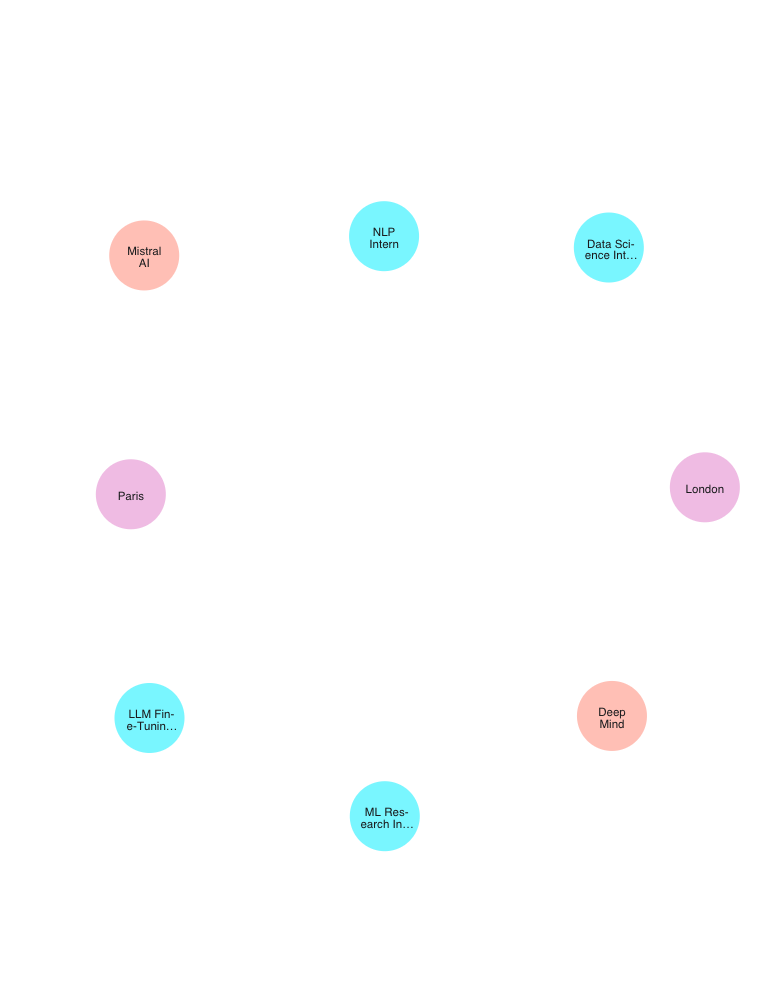

# 🧠 Neo4j Career Knowledge Graph

> Transform your job search from scattered spreadsheets into a **visual, queryable intelligence network**. Understand the job market. Find skill gaps. Discover hidden opportunities.


---

## 🎯 The Problem

You're tracking internship applications across dozens of websites. Your spreadsheet has grown to 100+ rows. You can see the data, but **can't see the patterns**:

- 📊 Which skills are actually in demand?
- 🎯 Which companies want *both* NLP AND Computer Vision (rare opportunities)?
- 🗺️ Which regions/sources yield the best-scoring jobs?
- 📈 Where's my skill gap vs. market demand?

**This project solves that.** It builds a graph knowledge base that reveals hidden connections and trends across your entire job pipeline.

---

## ✨ What You Get

A **Neo4j knowledge graph** that transforms:
```
Job Title + Company → Claude AI extracts skills → Graph relationships

Nodes: Jobs, Companies, Locations, Skills
Edges: offered_by, in_location, requires_skill
```

Three **power-query dashboards** that answer real career questions:

### Query 1: Rare Skill Combinations 🔍
Find companies requiring *both* NLP + Computer Vision — the most selective, research-heavy roles.

### Query 2: Market Demand vs. Your Coverage 📊
See which skills are in-demand and what % you've applied to. Identify gaps fast.

### Query 3: Source Performance by Region 🗺️
Discover which scraping sources find the best-scoring jobs in each region.

---

## 🚀 Quick Start

### 1️⃣ Clone & Install

```bash
git clone https://github.com/aaitdads16/neo4j-career-kg.git
cd neo4j-career-kg

# Create virtual environment
python3 -m venv venv
source venv/bin/activate

# Install dependencies
pip install -r requirements.txt
```

### 2️⃣ Set Up Neo4j

[Get a free Neo4j cloud instance](https://neo4j.com/cloud/) (comes with 5GB free storage).

Create `.env` file:
```env
NEO4J_URI=neo4j+s://your-instance.databases.neo4j.io
NEO4J_USERNAME=neo4j
NEO4J_PASSWORD=your_password
ANTHROPIC_API_KEY=sk-ant-...
```

### 3️⃣ Load Your Data

Prepare a spreadsheet (`tracker.xlsx`) with columns:
- `title` (job title)
- `company` (company name)
- `location` (city, country)
- `region` (e.g., "Europe", "US")
- `source` (where you found it: LinkedIn, Indeed, etc.)
- `relevance_score` (1-100, your ranking)
- `status` (Applied, Interview, Offer)
- `date_found` (when you discovered it)

Then run:
```bash
python load_graph.py
```

**What happens:**
- Reads your `tracker.xlsx`
- Creates nodes for Jobs, Companies, Locations, Skills
- Uses Claude AI to extract required skills from job title + company
- Builds relationships: Job → requires → Skill, Job → offered_by → Company, etc.
- Idempotent (safe to re-run — uses MERGE, not duplicate creates)

---

## 📊 Visualizations

### Job Market Geography 🌍
See how opportunities cluster across European cities:



*Companies and job positions visualized in Neo4j Bloom. Pink nodes = companies, cyan = roles, green location hubs.*

### Skill Ecosystem 🔗
Discover how skills relate to each other based on job postings:


*Skill clusters revealed through graph analysis. Cyan = high-demand skills (NLP, LLM, CV), green = foundational skills (Python, PyTorch).*

---

## 🔥 Power Queries

Run the three showcase queries:

```bash
python queries.py
```

### **Q1: Companies requiring both NLP + Computer Vision**
```
(output)
  Mistral AI: 2 role(s)
  DeepMind: 3 role(s)
  ...
```

Reveals the most competitive, research-focused companies. These are your *reach targets*.

---

### **Q2: Most in-demand skills + your coverage**
```
  NLP                   [██████████] 95.2%  demand=21  applied=20  (Domain)
  Python                [████░░░░░░] 48.5%  demand=33  applied=16  (Programming)
  PyTorch               [███░░░░░░░] 32.1%  demand=28  applied=9   (ML Framework)
  TensorFlow            [██░░░░░░░░] 18.7%  demand=43  applied=8   (ML Framework)
  SQL                   [█░░░░░░░░░] 9.3%   demand=54  applied=5   (Programming)
```

**Why it matters:** Shows where you're overexposed (NLP: 95% coverage), where you're blind (SQL: 9% coverage). Focus your upskilling on high-demand, low-coverage skills.

---

### **Q3: Average relevance score by region + source**
```
  Europe:
    LinkedIn    avg_score=78.5  jobs=23
    Indeed      avg_score=72.1  jobs=19
  
  North America:
    LinkedIn    avg_score=81.2  jobs=31
    Indeed      avg_score=68.9  jobs=27
```

**Why it matters:** Tells you where to spend scraping effort. If LinkedIn EU finds 81-score jobs but Indeed EU finds 72, focus on LinkedIn.

---

## 🧩 Architecture

```
tracker.xlsx
    ↓
load_graph.py  ─→  (for each job)
    ↓                ├─ Create Job node
    ├─ read Excel    ├─ Create Company node
    ├─ extract skills├─ Claude API: extract skills
    ├─ create nodes  ├─ Create Skill nodes + relationships
    ↓                └─ MERGE relationships
  Neo4j
    ├─ Job nodes (100+ internships)
    ├─ Company nodes (50+ companies)
    ├─ Skill nodes (200+ extracted skills)
    ├─ Location nodes (country + city)
    └─ Relationships: OFFERED_BY, IN_LOCATION, REQUIRES_SKILL
       ↓
    queries.py  ─→  Three power dashboards
       ├─ Q1: Rare skill combinations
       ├─ Q2: Demand vs. coverage
       └─ Q3: Source performance
```

---

## 🛠️ Key Files

| File | Purpose |
|------|---------|
| `load_graph.py` | Main ETL — reads tracker.xlsx, loads into Neo4j, calls Claude for skill extraction |
| `extract_skills.py` | Claude integration — extracts 4-6 skills per job, with fallback keyword matching |
| `queries.py` | Three showcase Cypher queries + debug mode (`--debug` flag) |
| `test_connection.py` | Verify Neo4j connectivity before running load_graph |
| `seed_test.py` | Optional — seed the database with 10 sample jobs for testing |

---

## 💡 Skill Categorization

Skills are automatically categorized:

- **Programming:** Python, SQL, Bash, R, Julia
- **ML Frameworks:** PyTorch, TensorFlow, Scikit-learn, Keras, JAX
- **Domains:** NLP, CV, Computer Vision, LLM, RL, GenAI
- **Tools:** Everything else (Git, Docker, AWS, etc.)

Customize in `load_graph.py` lines 85–92.

---

## 🔄 Re-running the Load

Safe to re-run. The graph uses `MERGE` (upsert) instead of `CREATE`, so:
- ✅ Updates existing jobs with new metadata
- ✅ Doesn't create duplicates
- ✅ Re-extracts skills (fresh Claude calls)

**⚠️ Warning:** Current config clears the graph on each run:
```python
session.run("MATCH (n) DETACH DELETE n")  # line 117
```

Comment this out to append instead of replace.

---

## 📈 Example Insights You'll Discover

After loading 100+ internships, you might find:

- **Skill Gaps:** You've applied to 30 Python roles but only 5 SQL roles, yet SQL is 2x more in-demand.
- **Sweet Spot:** DeepMind + Mistral are the only companies posting NLP+CV roles — focus there.
- **Source ROI:** LinkedIn EU finds 78-avg-score jobs; Indeed EU finds 68. LinkedIn is worth the effort.
- **Hiring Velocity:** Some regions post every 1-2 weeks; others are stale for months. Time your applications.

---

## 🐛 Debugging

If queries return empty results:

```bash
python queries.py --debug
```

Shows:
- Total node counts by label
- Relationship types and counts
- Sample jobs and skills
- Confirms data was loaded

---

## 🤝 Contributing

Improvements welcome! Ideas:

- [ ] Add salary data parsing
- [ ] Build a Discord bot that posts new matches
- [ ] Add interview round tracking
- [ ] Export to visual dashboard (Grafana, Streamlit)
- [ ] Skill recommendation engine ("You should learn X next")

---

## 📜 License

MIT License — use freely, fork it, adapt it.

---

## 🚀 What's Next?

1. Load your data: `python load_graph.py`
2. Run the queries: `python queries.py`
3. Explore in **Neo4j Bloom** (free visualization)
4. Customize for your needs (add columns, change queries)
5. Share your insights & help others level up their job search

---

**Built with 🧠 Neo4j, 🤖 Claude AI, and pure curiosity.**

Questions? Open an issue. Insights? Share them in the discussions!
