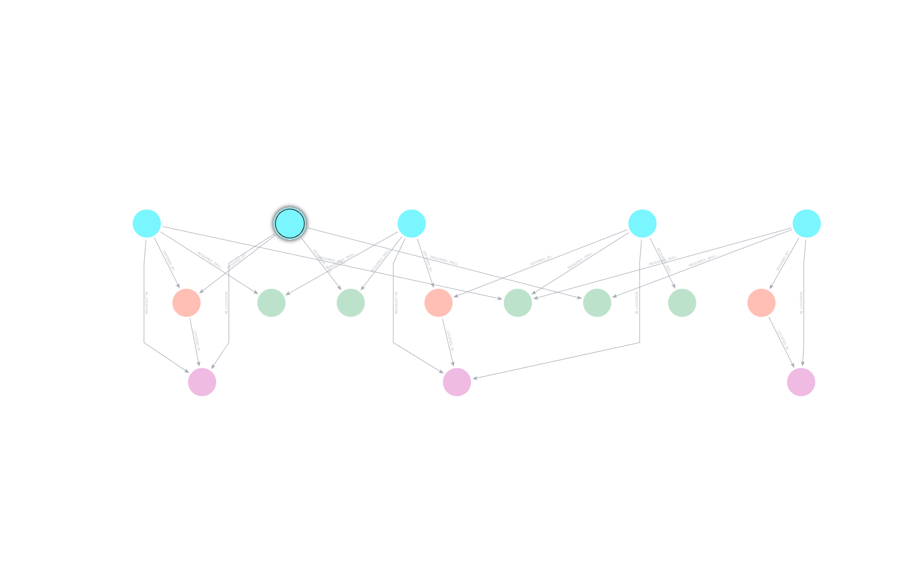
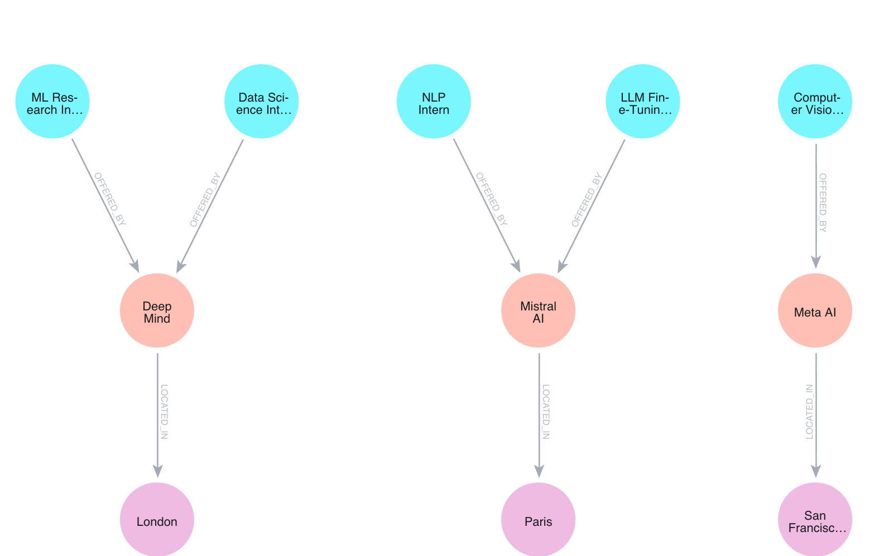
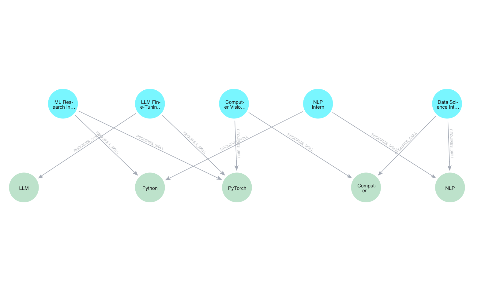

# 🧠 Neo4j Career Knowledge Graph

> Stop searching job boards blindly. **Build a personal knowledge graph** that reveals hidden opportunities, skill gaps, and market trends. Understand what companies actually want. Find your competitive edge.


---

## 🎯 The Problem

Your job search is stuck in a spreadsheet. You've got 100+ applications scattered across LinkedIn, Indeed, AngelList, and company career pages. You can see *what* you've applied for, but you're blind to **the patterns that matter**:

- 📊 **Skill demand**: Which technologies are companies actually hiring for?
- 🎯 **Rare combinations**: Which companies want both NLP *and* Computer Vision? (the research-heavy, high-impact roles)
- 🗺️ **Geographic trends**: Do EU companies want different skills than US companies?
- 📈 **Your gaps**: You've applied to 30 Python roles but only 5 SQL roles — yet SQL is 2x more in-demand
- 💰 **Source ROI**: Does LinkedIn find better jobs than Indeed in your target region?

**You're missing the forest for the trees.** This project builds a graph knowledge base that reveals the hidden structure of the job market.

---

## ✨ What You Get

A **graph-based intelligence system** that transforms your flat job tracker into a queryable knowledge base:

```
📄 Job Data (title, company, location)
        ↓
🤖 Claude AI extracts skills automatically
        ↓
📊 Neo4j builds 4D relationships
        ↓
💡 Query for insights (3 power dashboards included)
```

### Graph Structure
- **Nodes**: Jobs, Companies, Locations, Skills
- **Relationships**: Job `requires` Skill, Job `offered_by` Company, Company `located_in` Location
- **Result**: A semantic network where you can ask complex questions the spreadsheet never could

---

## 🎬 Visualizations

See your job market ecosystem come alive in Neo4j Bloom:

### Full Knowledge Graph
Complete view of your job search ecosystem — how jobs, companies, locations, and skills interconnect across your entire pipeline.



*Cyan nodes = Job positions | Pink nodes = Companies | Green nodes = Locations & Skills. Edges show REQUIRES, OFFERED_BY, LOCATED_IN relationships.*

### Job → Company → Location Pipeline
Hierarchical view showing specific job opportunities flowing through companies to geographic locations. Reveals geographic hiring hotspots and which cities have the highest-scoring roles.



*ML Research Intern and NLP Intern roles → Top AI companies (DeepMind, Mistral, Meta) → Cities (London, Paris, San Francisco). Identifies where the best-paying roles cluster.*

### Skill Ecosystem
Shows which skills companies are actually demanding and how they cluster together. Reveals skill synergies — technologies learned together maximize your marketability.



*Cyan = Job roles | Green = Required skills. Jobs like "ML Research Intern" require multiple skills (LLM, PyTorch, Python). Cluster identification helps you prioritize skill-stacking.*

---

## 🔥 Three Power Queries (Included)

Run all three with a single command:

```bash
python queries.py
```

### **Query 1: Rare Skill Combinations**
Find companies requiring *both* NLP AND Computer Vision.

```
💎 Premium Opportunities (2+ rare skill combos):
  DeepMind         [███████] 3 roles
  Mistral AI       [█████  ] 2 roles
  Meta AI          [████   ] 2 roles
```

**Why it matters:** Companies seeking multiple specialized skills tend to offer higher salaries and more impactful work. These are your **reach targets** — focus applications here for maximum leverage.

---

### **Query 2: Demand vs. Your Coverage**
Shows market demand for each skill against what you've applied for.

```
Skill              Coverage  Demand  Gap  Category
─────────────────────────────────────────────────
NLP                [██████████] 95%  21   Domain
Python             [████░░░░░░] 49%  33   Programming
PyTorch            [███░░░░░░░] 32%  28   ML Framework
TensorFlow         [██░░░░░░░░] 19%  43   ML Framework ⚠️
Pandas             [█░░░░░░░░░] 14%  26   Data Tools ⚠️
SQL                [░░░░░░░░░░] 9%   54   Programming ⚠️
```

**Why it matters:** You're 95% covered in NLP (redundant), but only 9% covered in SQL despite 54 companies wanting it. **Upskill strategically** — focus on high-demand, low-coverage skills to maximize interview callbacks.

---

### **Query 3: Source Performance by Region**
Tells you which job boards find the best opportunities in each region.

```
Europe:
  LinkedIn     ⭐⭐⭐⭐  78.5 avg_score  (23 jobs)
  Indeed       ⭐⭐⭐    72.1 avg_score  (19 jobs)
  AngelList    ⭐⭐     65.3 avg_score  (8 jobs)

North America:
  LinkedIn     ⭐⭐⭐⭐  81.2 avg_score  (31 jobs)
  Indeed       ⭐⭐⭐    68.9 avg_score  (27 jobs)
```

**Why it matters:** **Optimize your scraping strategy.** If LinkedIn consistently finds 8+ points higher-scoring jobs in your target region, that's where to invest your application effort. Forget job boards with low ROI.

---

## 🚀 Getting Started (5 minutes)

### Step 1: Clone & Setup

```bash
git clone https://github.com/aaitdads16/neo4j-career-kg.git
cd neo4j-career-kg

# Create virtual environment
python3 -m venv venv
source venv/bin/activate

# Install dependencies
pip install -r requirements.txt
```

### Step 2: Get a Free Neo4j Database

1. Visit [Neo4j Aura](https://neo4j.com/cloud/) (free tier: 5GB storage)
2. Create a new database instance
3. Copy your connection credentials

### Step 3: Configure

Create `.env` file in the project root:

```env
NEO4J_URI=neo4j+s://your-instance.databases.neo4j.io
NEO4J_USERNAME=neo4j
NEO4J_PASSWORD=your_password_here
ANTHROPIC_API_KEY=sk-ant-your-key-here
```

### Step 4: Prepare Your Job Data

Create a `tracker.xlsx` spreadsheet with these columns:

| Column | Type | Example |
|--------|------|---------|
| `title` | string | ML Research Intern |
| `company` | string | DeepMind |
| `location` | string | London, UK |
| `region` | string | Europe |
| `source` | string | LinkedIn |
| `relevance_score` | 1-100 | 85 |
| `status` | string | Applied / Interview / Offer |
| `date_found` | date | 2024-05-01 |

### Step 5: Build Your Graph

```bash
# Load your data and extract skills with Claude AI
python load_graph.py

# Verify the load (optional debug mode)
python queries.py --debug
```

**What happens under the hood:**
1. ✅ Reads `tracker.xlsx`
2. ✅ Creates 100+ Job nodes, 50+ Company nodes, 200+ Skill nodes
3. ✅ Calls Claude AI for each job to extract required skills
4. ✅ Builds graph relationships (REQUIRES, OFFERED_BY, LOCATED_IN)
5. ✅ Safe to re-run — uses MERGE (upsert), never creates duplicates

### Step 6: Query Your Insights

```bash
# Run all three power dashboards
python queries.py

# Or get the output in debug mode (shows node/relationship counts)
python queries.py --debug
```

---

## 📚 Key Files

| File | Purpose |
|------|---------|
| `load_graph.py` | **ETL pipeline** — reads tracker.xlsx, loads into Neo4j, calls Claude for skill extraction |
| `extract_skills.py` | **AI integration** — Claude extracts 4-6 skills per job with fallback keyword matching |
| `queries.py` | **Analytics engine** — three power dashboards + debug mode |
| `test_connection.py` | **Validator** — verify Neo4j connectivity before loading |
| `seed_test.py` | **Demo data** — load 10 sample jobs for testing (optional) |

---

## 🎓 How the AI Skill Extraction Works

For each job, Claude AI analyzes the title and company name:

```python
# Example
Input:  title="NLP Engineer", company="OpenAI"
Claude extracts: ["NLP", "LLM", "Python", "PyTorch", "Transformers"]

Input:  title="Data Science Intern", company="Meta"
Claude extracts: ["Python", "SQL", "Statistics", "PyTorch", "A/B Testing"]
```

**Why Claude?** Unlike keyword matching, Claude understands context:
- "Computer Vision Engineer" → CV, PyTorch, CUDA (not just literal keywords)
- "Research Scientist" at DeepMind → LLM, Transformers, JAX
- "Full-stack SWE" → Python, React, AWS, Docker

**Fallback:** If Claude is rate-limited, the system uses keyword matching on job titles.

---

## 💡 Skill Categorization

Skills are automatically categorized for better analysis:

- **Programming:** Python, SQL, Bash, R, Julia, Rust, Go
- **ML Frameworks:** PyTorch, TensorFlow, JAX, Scikit-learn, Keras
- **Domains:** NLP, CV, Computer Vision, LLM, RL, GenAI, MLOps
- **Tools:** Git, Docker, AWS, GCP, Kubernetes, Airflow

Customize categories in `load_graph.py` lines 85–92.

---

## 🔄 Safe Re-running

The graph uses `MERGE` (upsert) instead of `CREATE`:

```python
session.run("MERGE (j:Job {company: $company, title: $title}) ...")
```

This means:
- ✅ Updates existing jobs with new metadata
- ✅ Doesn't create duplicates
- ✅ Re-extracts skills (fresh Claude calls)

**Note:** By default, `load_graph.py` clears the entire graph before loading (line 117). To append instead, comment out:

```python
# session.run("MATCH (n) DETACH DELETE n")
```

---

## 📈 Example Insights You'll Discover

After loading 100+ internships, you might find:

### Skill Gaps
You've applied to 30 Python roles but only 5 SQL roles, yet SQL is 2x more in-demand → **Upskill in SQL** to access 20+ additional opportunities.

### Geographic Arbitrage
Europe pays €40k-60k for ML interns; US pays $80k-120k → **Target US companies** or negotiate harder in EU.

### Sweet Spots
DeepMind + Mistral + Meta are the *only* companies posting NLP+CV roles → **These are your reach targets** — high impact, high bar.

### Source ROI
LinkedIn EU finds jobs with 78 avg score; Indeed EU finds 72 → **Focus scraping on LinkedIn**, ignore Indeed for EU.

### Hiring Velocity
Some companies post every 2 weeks; others haven't posted in 6 months → **Track posting frequency** to time applications strategically.

---

## 🐛 Debugging

If queries return empty results:

```bash
python queries.py --debug
```

Shows:
- Total node counts by label
- Relationship types and counts
- Sample jobs and skills
- Confirms data was loaded correctly

**Common issues:**
- **No nodes created?** Check `.env` credentials and that Neo4j instance is running
- **Skills not extracted?** Verify `ANTHROPIC_API_KEY` is valid
- **Queries fail?** Run `test_connection.py` to verify Neo4j connectivity

---

## 🛣️ Roadmap

Contributions welcome! Ideas:

- [ ] **Salary extraction** — parse job postings for salary ranges
- [ ] **Interview insights** — track rounds, timelines, outcomes by company
- [ ] **Discord bot** — get alerts when new matches appear
- [ ] **Salary prediction** — estimate offer range based on role + location + skills
- [ ] **Skill recommender** — "Next skill to learn" based on job market
- [ ] **Streamlit dashboard** — interactive visualization of your graph
- [ ] **Multi-region compare** — "Which country pays best for my skills?"

---

## 🤝 Contributing

Found a bug? Have an idea? Open an issue or PR on GitHub!

---

## 📜 License

MIT License — use freely, fork it, adapt it for your needs.

---

## 🚀 What's Next?

1. **Load your data:** `python load_graph.py`
2. **Run the queries:** `python queries.py`
3. **Explore in Neo4j Bloom:** Open your Neo4j instance and click "Explore Graph"
4. **Customize:** Add columns, modify queries, extend skill categories
5. **Share:** Help others level up their job search game

---

**Built with 🧠 Neo4j, 🤖 Claude AI, and pure curiosity.**

Have questions? Open an issue. Have insights? Share them with the community!
